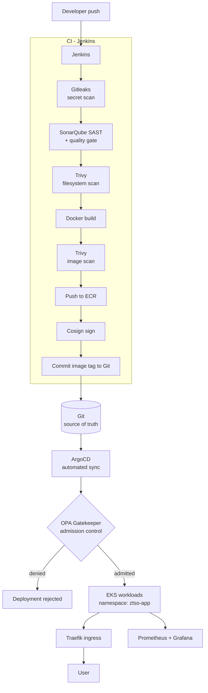

# ZeroTrustSecOps (ZTSO)

A hardened CI/CD pipeline applying Zero Trust principles across **build, ship and run** — built on AWS EKS with Jenkins, ArgoCD and OPA Gatekeeper.

Nothing is trusted because of where it came from. Code is scanned before it builds, images are scanned and signed before they ship, and the cluster re-checks every workload at the admission boundary before it runs.

---

## Architecture



Jenkins never deploys. It only writes to Git. Git is the single source of truth for cluster state.

---

## Stack

| Layer | Technology |
|---|---|
| Cloud / orchestration | AWS EKS, ECR, EC2 |
| CI | Jenkins (declarative pipeline) |
| CD | ArgoCD (GitOps: automated sync, self-heal, prune) |
| Packaging | Helm |
| SAST | SonarQube, with a blocking quality gate |
| Secret detection | Gitleaks |
| Vulnerability scanning | Trivy (filesystem + image) |
| Image signing | Cosign |
| Policy enforcement | OPA Gatekeeper — 4 constraints, deny mode |
| Ingress | Traefik |
| Observability | Prometheus + Grafana (kube-prometheus-stack) |
| Application | Flask API + MySQL 8.0 + static frontend behind nginx |

---

## Repository layout

```
backend/                     Flask API (notes service)
frontend/                    Static UI + nginx config
database/init.sql            Schema and seed data
Jenkinsfile                  CI pipeline definition
docker-compose.yml           Local development stack
sonar-project.properties     SonarQube scanner config
cosign.pub                   Public verification key (safe to commit)
sast-test-fixtures.txt       Deliberately vulnerable snippet, used to prove SAST fires

k8s/
  helm/ztso/                 Helm chart deployed by ArgoCD
  argocd/                    ArgoCD Application + values override
  gatekeeper/                ConstraintTemplates and Constraints
  manifests/                 Plain manifests (pre-Helm, kept for reference)
  ingress.yaml               Traefik ingress
  monitoring-values.yaml     kube-prometheus-stack values
```

Infrastructure provisioning — VPC, subnets, route tables, security groups, IAM and EC2 —
is handled by Terraform and is **not** stored in this repository. See *Known limitations*.

---

## CI pipeline

Defined in `Jenkinsfile`. The **Enforcement** column describes what actually happens on a
finding, rather than what the stage is named.

| # | Stage | Tool | Enforcement |
|---|---|---|---|
| 1 | Checkout | git | Derives the image tag from the short commit SHA |
| 2 | Secret scan | Gitleaks | **Blocking** — a finding fails the build |
| 3 | SAST | SonarQube | Analysis |
| 4 | Quality gate | SonarQube | **Blocking** — `abortPipeline: true` |
| 5 | Filesystem scan | Trivy | Advisory — report archived, build continues |
| 6 | Build | Docker | Backend and frontend images |
| 7 | Image scan (CRITICAL) | Trivy | **Blocking** — `--exit-code 1 --ignore-unfixed` |
| 8 | Image scan (HIGH) | Trivy | Advisory — recorded for triage |
| 9 | Push | AWS ECR | Authenticated at pipeline runtime |
| 10 | Sign | Cosign | Key and passphrase injected from Jenkins credentials |
| 11 | Update image tag | git | Commits the new tag — **the only deploy trigger** |

Scan reports are archived as build artifacts.

**Why CRITICAL blocks and HIGH does not.** Blocking on HIGH in a project using a stock
MySQL image and a Debian-based Python base would fail every build on findings that have no
available fix. `--ignore-unfixed` combined with a CRITICAL-only gate keeps the control
meaningful instead of training everyone to bypass it. HIGH findings are still recorded and
reviewed.

### Credential handling

No credential is stored in this repository or inlined in the pipeline. All are bound at
runtime through Jenkins credentials:

- `cosign-private-key` (file binding) and `cosign-password` (string binding)
- `gitCredentials` (username/password binding, used for the tag-update commit)
- `slack-webhook-jenkins` (string binding)

---

## GitOps deployment

`k8s/argocd/application.yaml` defines the ArgoCD Application:

- **Source:** this repository, Helm chart at `k8s/helm/ztso`
- **Sync policy:** automated, with `prune` and `selfHeal` enabled
- **Destination:** namespace `ztso-app`

Because self-heal is enabled, a manual `kubectl edit` against a managed resource is
reverted. The only supported way to change what is running is to change Git.

---

## Admission control

Four OPA Gatekeeper constraints, all in `enforcementAction: deny`, scoped to `ztso-app`:

| Constraint | Enforces |
|---|---|
| `no-root-containers` | `runAsNonRoot` must be set; containers may not run as root |
| `no-latest-image-tag` | Rejects `:latest` — deployments must reference an immutable tag |
| `require-resource-limits` | CPU and memory limits are mandatory |
| `require-approved-registry` | Images must come from the approved ECR registry allow-list |

### An honest note on `require-approved-registry`

This constraint performs **registry allow-listing, not cryptographic signature
verification.** OPA Gatekeeper evaluates Rego without network access during admission, so
it cannot contact a registry to validate a Cosign signature. The control verifies that an
image originates from the approved ECR registry; it does not prove the image was signed.

Images *are* signed by Cosign in the pipeline (stage 10), and `cosign.pub` is committed
for out-of-band verification. Closing the loop at admission time requires either
Gatekeeper's external data provider (`cosign-gatekeeper-provider`) or Kyverno's
`verifyImages` rule. This is tracked in *Known limitations*.

A control named for a stronger guarantee than it delivers is worse than no control,
because everything downstream assumes the guarantee holds. This constraint is named for
what it does.

### Verifying enforcement

```bash
kubectl run rogue --image=nginx:1.25 -n ztso-app
```

Expected:

```
Error from server (Forbidden): admission webhook "validation.gatekeeper.sh" denied the request:
[require-approved-registry] Container 'nginx:1.25' uses an image outside the approved registry list
[no-latest-image-tag] ...
[no-root-containers] ...
[require-resource-limits] ...
```

---

## Networking

Traefik is the single ingress point for the application namespace:

- `/` → `frontend` service, port 8080
- `/api` → `backend` service, port 3000

All application services are `ClusterIP`. **The backend is never directly reachable from
outside the cluster** — traffic reaches it only through the ingress. NodePort was
deliberately rejected: it opens a port on every node and creates multiple uncontrolled
entry paths.

---

## Secrets management

Application secrets are **not** stored in this repository. The Secret is created out of
band before the first deploy:

```bash
kubectl create secret generic db-secret -n ztso-app \
  --from-literal=MYSQL_ROOT_PASSWORD='<value>' \
  --from-literal=MYSQL_DATABASE='notesdb' \
  --from-literal=MYSQL_USER='<value>' \
  --from-literal=MYSQL_PASSWORD='<value>'
```

The application reads credentials from environment variables sourced from that Secret —
`secretKeyRef` for the backend, `envFrom` for the database. No credential appears in
application code.

For local development, `docker-compose.yml` reads the same four variables from a `.env`
file, which is gitignored.

---

## Observability

`kube-prometheus-stack` is deployed in the `monitoring` namespace, in-cluster rather than
on a separate EC2 instance. This avoids cross-VM authentication between Prometheus and the
cluster, and removed one instance from the footprint entirely.

Grafana provides cluster and pod health dashboards. Build-failure notification is handled
separately by Jenkins via Slack and email.

---

## Running locally

Create a `.env` file in the repository root:

```
MYSQL_ROOT_PASSWORD=<value>
MYSQL_DATABASE=notesdb
MYSQL_USER=<value>
MYSQL_PASSWORD=<value>
```

Then:

```bash
docker compose up --build
```

Frontend on `http://localhost:8000`, API on `http://localhost:3000`.

## Deploying to EKS

```bash
# 1. Admission policies first — apply before any workload
kubectl apply -f k8s/gatekeeper/

# 2. Create the application secret (see Secrets management)

# 3. ArgoCD takes over from here
kubectl apply -f k8s/argocd/application.yaml

# 4. Ingress
kubectl apply -f k8s/ingress.yaml
```

Apply the Gatekeeper constraints **before** the first deploy. Workloads that land first
are admitted unchecked and are only re-evaluated on their next update.

---

## Security principles demonstrated

- **Shift left** — secrets, code quality and CVEs are checked before an image exists
- **Defence in depth** — the same concerns are re-checked at admission, not only in CI
- **Separation of duties** — the build system cannot deploy; it can only propose a change to Git
- **Immutable, verifiable artifacts** — commit-SHA tags, signed images, no `:latest`
- **Least privilege at runtime** — non-root containers, no privilege escalation, resource limits
- **Single controlled entry point** — one ingress; backend services never directly exposed
- **Declarative, auditable state** — every change to what runs is a reviewable Git commit

---

## Known limitations

Tracked openly, because an undocumented gap is worse than a documented one.

| # | Limitation | Planned fix |
|---|---|---|
| 1 | Admission control checks registry origin, not Cosign signatures | Kyverno `verifyImages`, or Gatekeeper's external data provider |
| 2 | Secrets are created out of band, so cluster state is not fully reproducible from Git | External Secrets Operator + AWS Secrets Manager via IRSA |
| 3 | No NetworkPolicies — pod-to-pod traffic inside `ztso-app` is unrestricted | Default-deny policy with explicit frontend → backend → database allows |
| 4 | MySQL schema changes are applied manually via `kubectl exec` (stock image, no custom entrypoint) | Migration job in the Helm chart |
| 5 | Terraform infrastructure code is not in this repository | Consolidate into `terraform/` |
| 6 | Trivy HIGH findings are advisory only | Tighten once base images are pinned and patched |

---

## Author

**Tanishq Sonar** — [GitHub](https://github.com/Tanishq0555) · [LinkedIn](https://www.linkedin.com/in/tanishqsonar)
